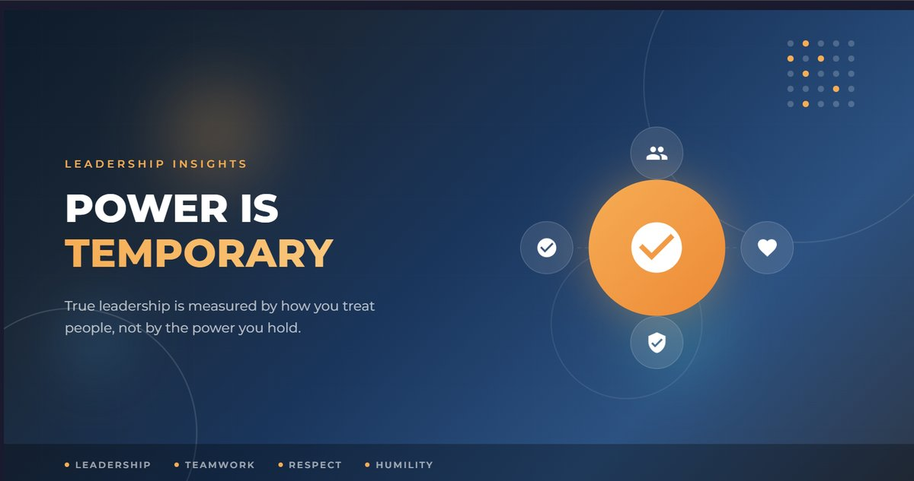

# *Power Is Temporary, But Leadership Is Remembered*

---
## English Version

# Power Is Temporary, But Leadership Is Remembered

Success, power, influence, and position are important achievements in life. However, the true measure of a person's success is not determined by their title or authority. It is reflected in how they treat other people.

Sometimes, when people suddenly achieve a position of power or significant success, their behavior begins to change. They gradually forget their past, their struggles, and the people who supported them along the way.

Over time, success can turn into arrogance.

And the greatest danger of arrogance is that **it disconnects people from reality.**

## Arrogance Never Creates Lasting Success

Jealousy, arrogance, disrespect, and belittling others may create a temporary sense of power.

But in the long run, these behaviors cannot build healthy relationships, strong teams, or successful organizations.

Instead, they create distrust, distance, division, and eventually—breakdown.

No matter how successful a person becomes, they should remember where they started and the people who helped them along the way.

**Forgetting your past is not simply forgetting your history; sometimes, it means forgetting your roots.**

## Respect and Compassion Build Stronger Teams

People do not only want money, titles, or promotions.

They want to be valued.

They want their opinions to matter. They want to be treated with dignity. And most importantly, they want to be respected as human beings.

In an organization, employees do not work only for salaries or promotions. They also want an environment where their contributions are recognized and where they are treated with respect.

When a leader listens to people, respects their opinions, and shares success with the team, something powerful develops:

**Trust.**

And trust is one of the strongest foundations of a successful team.

## Power Is Temporary

Positions change.

Titles change.

Authority changes.

One day, the chair you occupy may belong to someone else.

But the way you treated people can remain in their memories for years.

People may remember a strict manager because of their position.

But they remember a great leader because of their character, humanity, support, and the way that leader made them feel.

Therefore, leadership should not be measured by how much power someone possesses.

It should be measured by **how responsibly they use that power.**

## What Does a True Leader Look Like?

A true leader does not simply give instructions.

**They lead from the front.**

They take responsibility. They work alongside their team. They understand that organizational success is not an individual achievement—it is the result of collective effort.

A good leader:

- Takes responsibility and encourages others to do the same.
- Focuses on solutions instead of blaming people.
- Listens to and values the opinions of colleagues.
- Shares success with the team.
- Is willing to take responsibility for failure.
- Treats both junior and senior colleagues with respect.
- Leads through trust, collaboration, and example rather than authority alone.

Most importantly, a true leader never considers themselves superior to the people they lead.

**Leadership is not about standing above people; it is about standing beside them and helping them move forward.**

## Final Thoughts

In life, we may achieve many things—wealth, position, power, recognition, and social status.

But eventually, our greatest legacy is not what we possessed.

It is **how we treated people.**

**Arrogance creates distance.
Disrespect weakens relationships.
Jealousy creates division.**

On the other hand—

**Compassion brings people closer.
Respect strengthens relationships.
Collaboration moves teams forward.
And humility creates true leadership.**

Because **power is temporary, but respect and genuine human connection can last far beyond a position or title.**

The greatest achievement of a true leader is not the title they hold.

It is this:

**Even after they are gone, people remember them with respect.**

That is the real legacy of leadership.

## বাংলা সংস্করণ

# ক্ষমতা নয়, মানুষই একজন নেতার আসল পরিচয়

জীবনে সাফল্য, ক্ষমতা কিংবা প্রভাব অর্জন করা নিঃসন্দেহে গুরুত্বপূর্ণ। কিন্তু সেই সাফল্য একজন মানুষকে কতটা বড় করেছে, তার প্রকৃত মূল্যায়ন হয় সে অন্য মানুষের সঙ্গে কীভাবে আচরণ করে—তার মাধ্যমে।

অনেক সময় মানুষ যখন দ্রুত বড় কোনো অবস্থান, ক্ষমতা কিংবা সাফল্য অর্জন করে, তখন তার আচরণে পরিবর্তন আসে। সে ধীরে ধীরে নিজের অতীত, সংগ্রামের দিনগুলো এবং যারা তার পথচলায় পাশে ছিল—তাদের কথা ভুলে যেতে শুরু করে। একসময় সেই পরিবর্তন অহংকারে রূপ নেয়।

আর অহংকারের সবচেয়ে বড় সমস্যা হলো—এটি মানুষকে বাস্তবতা থেকে দূরে সরিয়ে দেয়।

## অহংকার কখনো স্থায়ী সাফল্য তৈরি করে না

হিংসা, অহংকার, অন্যকে ছোট করা কিংবা অসম্মান—এসব আচরণ হয়তো সাময়িকভাবে একজন মানুষকে ক্ষমতাবান মনে করাতে পারে। কিন্তু দীর্ঘমেয়াদে এগুলো কোনো সুস্থ সম্পর্ক, শক্তিশালী দল কিংবা সফল প্রতিষ্ঠান গড়ে তুলতে পারে না।

বরং এগুলো তৈরি করে অবিশ্বাস, দূরত্ব এবং বিভাজন।

একজন মানুষ যত উপরে উঠুক না কেন, তার মনে রাখা উচিত—সে একদিন কোথা থেকে শুরু করেছিল। তার সাফল্যের পেছনে পরিবার, সহকর্মী, বন্ধু, শিক্ষক কিংবা অন্য কোনো মানুষের অবদান রয়েছে।

**অতীতকে ভুলে যাওয়া শুধু স্মৃতিকে ভুলে যাওয়া নয়; অনেক সময় এটি নিজের শিকড়কে ভুলে যাওয়া।**

## ভালোবাসা ও সম্মান মানুষকে একত্রিত করে

মানুষ শুধু অর্থ, পদবি কিংবা ক্ষমতা চায় না। মানুষ চায় তাকে মূল্যায়ন করা হোক। সে চায় তার সঙ্গে সুন্দরভাবে কথা বলা হোক, তার মতামতকে গুরুত্ব দেওয়া হোক এবং তাকে একজন মানুষ হিসেবে সম্মান করা হোক।

একটি প্রতিষ্ঠানে কর্মীরা শুধু বেতন বা পদোন্নতির জন্য কাজ করে না। তারা এমন একটি পরিবেশও চায় যেখানে তাদের অবদানকে স্বীকৃতি দেওয়া হবে এবং তাদের সঙ্গে মর্যাদাপূর্ণ আচরণ করা হবে।

একজন নেতা যখন তার সহকর্মীদের সম্মান করেন, তাদের কথা শোনেন এবং তাদের সাফল্যের অংশীদার করেন, তখন দলের মধ্যে আস্থা তৈরি হয়।

আর **আস্থাই একটি শক্তিশালী দলের অন্যতম প্রধান ভিত্তি।**

## ক্ষমতা সাময়িক, কিন্তু মানুষের মনে জায়গা করে নেওয়া দীর্ঘস্থায়ী

পদবি পরিবর্তন হতে পারে। ক্ষমতা চলে যেতে পারে। একটি চেয়ার একদিন অন্য কারও হতে পারে।

কিন্তু একজন মানুষ অন্য মানুষের সঙ্গে কেমন আচরণ করেছে—সেই স্মৃতি অনেক দীর্ঘস্থায়ী।

একজন কঠোর বসকে মানুষ হয়তো তার পদটির কারণে মনে রাখবে। কিন্তু একজন ভালো নেতাকে মানুষ মনে রাখবে তার আচরণ, সহযোগিতা, মানবিকতা এবং নেতৃত্বের জন্য।

তাই নেতৃত্বের প্রকৃত মূল্য ক্ষমতার পরিমাণ দিয়ে নির্ধারিত হয় না; বরং নির্ধারিত হয় একজন নেতা তার ক্ষমতাকে কীভাবে ব্যবহার করছেন, তার মাধ্যমে।

## সত্যিকারের নেতা কেমন?

একজন সত্যিকারের নেতা শুধু নির্দেশ দেন না—তিনি নিজেও কাজের মাঠে থাকেন।

তিনি জানেন, একটি দলের সামনে এগিয়ে যাওয়া মানে শুধু নিজের সাফল্য নিশ্চিত করা নয়; বরং দলের প্রত্যেক সদস্যকে সঙ্গে নিয়ে এগিয়ে যাওয়া।

একজন ভালো নেতা:

- নিজে দায়িত্ব নেন এবং অন্যদেরও দায়িত্ব নিতে উৎসাহিত করেন।
- ভুল হলে অন্যকে দোষারোপ না করে সমাধানের পথ খোঁজেন।
- সহকর্মীদের মতামতকে গুরুত্ব দেন।
- সফলতার কৃতিত্ব দলের সঙ্গে ভাগ করে নেন।
- ব্যর্থতার দায় নিজের কাঁধে নিতে প্রস্তুত থাকেন।
- জুনিয়র ও সিনিয়র—সবার সঙ্গে সম্মানজনক আচরণ করেন।
- ক্ষমতার পরিবর্তে আস্থা ও সহযোগিতার মাধ্যমে নেতৃত্ব দেন।

সবচেয়ে গুরুত্বপূর্ণ বিষয় হলো, একজন সত্যিকারের নেতা কখনো নিজেকে দলের উপরে মনে করেন না।

**নেতৃত্ব মানে সবার সামনে দাঁড়িয়ে থাকা নয়; অনেক সময় সবার পাশে দাঁড়িয়ে তাদের সামনে এগিয়ে যেতে সাহায্য করাই নেতৃত্ব।**

## শেষ কথা

জীবনে আমরা অনেক কিছু অর্জন করতে পারি—পদ, অর্থ, ক্ষমতা, পরিচিতি কিংবা সামাজিক মর্যাদা।

কিন্তু শেষ পর্যন্ত আমাদের সবচেয়ে বড় পরিচয় হয়ে থাকে—আমরা অন্য মানুষের সঙ্গে কেমন আচরণ করেছি।

**অহংকার মানুষকে আলাদা করে।
অসম্মান সম্পর্ককে দুর্বল করে।
হিংসা বিভাজন তৈরি করে।**

অন্যদিকে—

**ভালোবাসা মানুষকে কাছে আনে।
সম্মান সম্পর্ককে শক্তিশালী করে।
সহযোগিতা দলকে এগিয়ে নেয়।
আর বিনয় একজন নেতাকে সত্যিকারের নেতা করে তোলে।**

কারণ **ক্ষমতা সাময়িক, কিন্তু মানুষের হৃদয়ে অর্জন করা সম্মান ও ভালোবাসা অনেক বেশি স্থায়ী।**

একজন সত্যিকারের নেতার সবচেয়ে বড় অর্জন তার পদবি নয়—**তার অনুপস্থিতিতেও মানুষ যেন তাকে সম্মানের সঙ্গে স্মরণ করে, সেটিই তার প্রকৃত নেতৃত্বের পরিচয়।**

---

---